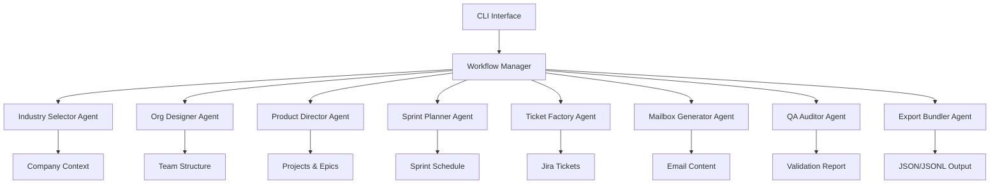

# Productivity Crew - Multi-Agent Data Generator

[](https://www.python.org/downloads/)
[](https://github.com/psf/black)
[](https://mypy.readthedocs.io/)

A production-ready CrewAI multi-agent application that generates synthetic Jira tickets and emails for realistic team scenarios. Built for testing, development, and training purposes with enterprise-grade quality standards.

## 🎯 Features

- **Multi-Agent Architecture**: CrewAI-powered agents with specialized responsibilities
- **Realistic Data Generation**: Authentic Jira tickets and email conversations
- **Role-Based Personas**: Junior/Senior Engineers, Team Leads, and Managers
- **Industry-Specific Content**: Fintech SaaS domain expertise built-in
- **Production Quality**: Comprehensive validation, testing, and documentation
- **Deterministic Output**: Reproducible results with configurable seeding
- **Privacy Compliant**: Synthetic data with no real personal information

## 🏗️ Architecture



## 🚀 Quick Start

### Prerequisites

- Python 3.11 or higher
- OpenAI API key

### Installation

```bash
# Clone the repository
git clone <repository-url>
cd productivity

# Install dependencies
pip install -e .

# Or using uv (recommended)
uv sync

# Set up environment
cp env.example .env
# Edit .env and add your OPENAI_API_KEY
```

### Basic Usage

```bash
# Generate data with default configuration
python -m src.cli.generate --config configs/single_team_fintech.yaml --out out

python -m src.cli.generate clear && CREWAI_TELEMETRY_DISABLED=true python -m src.cli.generate generate

# Validate configuration without generating
python -m src.cli.generate --config configs/single_team_fintech.yaml --dry-run

# Enable verbose logging
python -m src.cli.generate --config configs/single_team_fintech.yaml --verbose
```

### Output Structure

```
out/
├── jira.json                    # All Jira tickets
├── mail_PER-0001.jsonl         # Email for person 1
├── mail_PER-0002.jsonl         # Email for person 2
├── ...                         # One file per team member
└── index.json                  # Metadata and integrity hashes
```

## 📋 Configuration

### Sample Configuration

```yaml
industry: Fintech SaaS
company:
  name: VistaraPay
  mission: Simplify digital payments for SMEs across India.
  tone: concise, data-first, supportive
  values: ["Customer obsession", "Bias for action", "Ownership"]

time_window:
  start: 2025-07-01
  end: 2025-08-07
  business_days_only: true
  timezone: Asia/Kolkata

org:
  team_name: Payments Core
  geo: ["Bengaluru", "Mumbai", "Remote-IN"]
  levels: ["Jr", "Sr", "TL", "Mgr"]
  manager_span: {min: 6, max: 8}

project:
  key: PAY
  name: Payments Reliability
  sprint_length_days: 14

volumes:
  jira_tickets_in_window: {min: 28, max: 40}
  emails_per_person_per_week: {min: 25, max: 60}
  comment_ratio: 1.6

outputs: ["jira", "email"]
```

### Configuration Validation

The system validates all configuration parameters:

- Required fields presence
- Valid date ranges and formats
- Realistic volume constraints
- Proper team structure requirements

## 👥 Personas

### Junior Engineer (`Jr`)
- **Communication**: Question-heavy, learning-focused
- **Email Volume**: 25-35 per week
- **Categories**: 60% work, 10% managerial
- **Tickets**: Simple tasks, 1-3 story points

### Senior Engineer (`Sr`)
- **Communication**: Solution-oriented, technical depth
- **Email Volume**: 35-50 per week  
- **Categories**: 65% work, 15% managerial
- **Tickets**: Complex features, 5-13 story points

### Team Lead (`TL`)
- **Communication**: Coordinating, balanced technical/people
- **Email Volume**: 45-60 per week
- **Categories**: 55% work, 25% managerial
- **Tickets**: Architecture, coordination tasks

### Manager (`Mgr`)
- **Communication**: Strategic, people-focused
- **Email Volume**: 60-80 per week
- **Categories**: 35% work, 35% managerial, 20% non-project
- **Tickets**: Process, high-level coordination

## 🧪 Validation Rules

The system enforces realistic business rules:

### Email Rules
- ✅ Ticket references must use `[KEY-####]` format in subjects
- ✅ 85% of emails during business hours (9 AM - 6 PM IST)
- ✅ Manager inboxes must have ≥20% non-project categories
- ✅ Spam must be ≤5% of total emails

### Ticket Rules
- ✅ "Done" tickets must have code review comments
- ✅ Status transitions must be chronological
- ✅ All assignees and reporters must be valid team members
- ✅ Story points distribution follows realistic patterns

### Data Integrity
- ✅ All references must resolve to valid entities
- ✅ Deterministic ordering by IDs and timestamps
- ✅ Schema compliance for all generated data

## 🏭 Industry Packs

### Fintech SaaS (Built-in)
- **Products**: Payment Gateway, KYC Platform, Fraud Detection
- **Constraints**: RBI compliance, PCI DSS, 99.9% uptime
- **Tech Stack**: Java/Python, React, PostgreSQL, AWS
- **Jargon**: TPS, UPI, KYC, AML, fraud scoring

### Extensible Design
Add custom industry packs by implementing the `IndustryPack` interface:

```python
from src.industry_packs.base import BaseIndustryPack

class CustomIndustryPack(BaseIndustryPack):
    def get_products(self) -> List[str]:
        return ["Product A", "Product B"]
    
    def get_constraints(self) -> List[str]:
        return ["Constraint 1", "Constraint 2"]
```

## 🧪 Testing

### Run Tests

```bash
# Run all tests
pytest

# Run with coverage
pytest --cov=src --cov-report=html

# Run specific test categories
pytest tests/unit/
pytest tests/e2e/

# Run with verbose output
pytest -v
```

### Test Coverage

- **Unit Tests**: ID generation, validation, persona registry
- **Integration Tests**: Agent workflows, data generators
- **E2E Tests**: Complete workflow with mocked LLM calls
- **Validation Tests**: Business rule compliance

### Code Quality

```bash
# Type checking
mypy src/

# Linting
ruff check src/

# Code formatting
black src/

# All checks
pre-commit run --all-files
```

## 📊 Output Examples

### Jira Ticket
```json
{
  "ticket_id": "PAY-1421",
  "project_id": "PROJ-PAY",
  "epic_id": "EPIC-PAY-01",
  "type": "Story",
  "title": "Implement UPI payment retry mechanism",
  "description": "Add automatic retry logic for failed UPI transactions...",
  "priority": "High",
  "story_points": 5,
  "reporter_id": "PER-0004",
  "assignee_id": "PER-0002",
  "status_timeline": [
    {"status": "To Do", "at": "2025-07-01T09:30:00+05:30"},
    {"status": "In Progress", "at": "2025-07-02T10:15:00+05:30"},
    {"status": "Done", "at": "2025-07-05T16:45:00+05:30"}
  ],
  "comments": [
    {
      "author_id": "PER-0002",
      "at": "2025-07-03T14:20:00+05:30",
      "body": "Implemented retry logic with exponential backoff. Ready for review."
    },
    {
      "author_id": "PER-0003",
      "at": "2025-07-04T11:10:00+05:30",
      "body": "Code looks good. LGTM! Please update the API documentation."
    }
  ]
}
```

### Email Message
```json
{
  "msg_id": "MSG-157",
  "thread_id": "MAIL-TH-042",
  "subject": "Re: [PAY-1421] UPI retry mechanism - performance concerns",
  "from": "senior.engineer@vistarapay.com",
  "to": ["team.lead@vistarapay.com"],
  "cc": ["manager@vistarapay.com"],
  "timestamp": "2025-07-03T15:30:00+05:30",
  "body_md": "I've reviewed the retry implementation. The exponential backoff looks good, but we should consider adding circuit breaker pattern for downstream service failures...",
  "category": "work",
  "importance": "high",
  "refs": {
    "ticket_ids": ["PAY-1421"],
    "pr_ids": [],
    "doc_ids": []
  }
}
```

## 🔧 Development

### Project Structure

```
src/
├── app/                    # Application configuration and logging
├── okg/                    # Organizational Knowledge Graph models
├── agents/                 # CrewAI agent implementations
├── personas/               # Role-based behavior patterns
├── industry_packs/         # Industry-specific content
├── sources/                # Data generators (Jira, Email)
├── exporters/              # Output formatters
├── workflows/              # Orchestration logic
├── utils/                  # Utilities (time, sampling, hashing)
└── cli/                    # Command-line interface
```

### Adding New Agents

1. Inherit from `BaseAgent`
2. Implement required methods
3. Add to workflow manager
4. Write tests

```python
from src.agents.base import BaseAgent

class CustomAgent(BaseAgent):
    @property
    def role(self) -> str:
        return "Custom Specialist"
    
    @property
    def goal(self) -> str:
        return "Perform custom analysis"
    
    def create_task(self, description: str, context: Dict[str, Any]) -> Task:
        # Implementation
        pass
```

## 🚨 Known Limitations

- **LLM Dependency**: Requires OpenAI API for agent execution
- **English Only**: Currently supports English language content
- **Single Industry**: Primary focus on Fintech SaaS (extensible)
- **Memory Usage**: Large datasets may require substantial RAM
- **Rate Limits**: OpenAI API rate limits may affect generation speed

## 🔮 Roadmap

- [ ] **Multi-Industry Support**: Healthcare, E-commerce, EdTech packs
- [ ] **Calendar Integration**: Meeting schedules and conflicts
- [ ] **Slack/PR Activity**: Developer collaboration data
- [ ] **Incident Management**: Crisis scenarios and escalations
- [ ] **Performance Optimization**: Batch processing and caching
- [ ] **Web Interface**: GUI for configuration and monitoring

## 🤝 Contributing

1. Fork the repository
2. Create feature branch (`git checkout -b feature/amazing-feature`)
3. Make changes with tests
4. Run quality checks (`pre-commit run --all-files`)
5. Commit changes (`git commit -m 'Add amazing feature'`)
6. Push to branch (`git push origin feature/amazing-feature`)
7. Open Pull Request

### Development Setup

```bash
# Install development dependencies
pip install -e ".[dev]"

# Set up pre-commit hooks
pre-commit install

# Run tests before committing
pytest tests/
```

## 📜 License

This project is licensed under the MIT License - see the [LICENSE](LICENSE) file for details.

## 🆘 Support

- **Documentation**: Check this README and inline code comments
- **Issues**: Use GitHub Issues for bug reports and feature requests
- **Discussions**: Use GitHub Discussions for questions and ideas
- **Email**: [Contact the maintainers](mailto:support@example.com)

---

**Generated with ❤️ by Productivity Crew - Synthetic data for real productivity**
